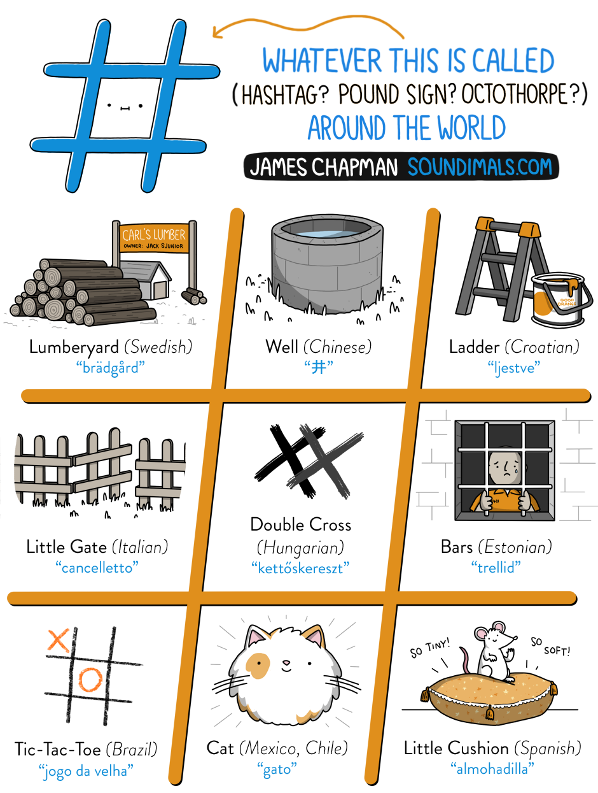

# Symbols {#sec-symbols}

| Symbol | psyTeachR Term    | Also Known As     |
|:------:|:------------------|:------------------|
| ()     | (round) brackets  | parentheses       |
| []     | square brackets   | brackets          |
| {}     | curly brackets    | squiggly brackets |
| <>     | chevrons          | angled brackets / guillemets |
| <      | less than         |                   |
| >      | greater than      |                   |
| &      | ampersand         | "and" symbol      |
| #      | hash              | pound / octothorpe|
| /      | slash             | forward slash     |
| \\     | backslash         |                   |
| -      | dash              | hyphen / minus    |
| _      | underscore        |                   |
| *      | asterisk          | star              |
| ^      | caret             | power symbol      |
| ~      | tilde             | twiddle / squiggle|
| =      | equal sign        |                   |
| ==     | double equal sign |                   |
| .      | full stop         | period / point    |
| !      | exclamation mark  | bang / not        |
| ?      | question mark     |                   |
| '      | single quote      | quote / apostrophe|
| "      | double quote      | quote             |
| %>%    | pipe              | magrittr pipe     |
| \|     | vertical bar      | pipe              |
| ,      | comma             |                   |
| ;      | semi-colon        |                   |
| :      | colon             |                   |
| @      | "at" symbol       | [various hilarious regional terms](https://www.theguardian.com/notesandqueries/query/0,5753,-1773,00.html) |
| ...    | `glossary("ellipsis")`| dots     |


```{r}
#| label: fig-soundimals-hash
#| echo: false
#| fig-cap: "[Image by James Chapman/Soundimals](https://soundimals.tumblr.com/post/167354564886/chapmangamo-the-symbol-has-too-many-names)"
#| fig-alt: "Picture of # with the title: 'WHATEVER THIS IS CALLED (HASHTAG? POUND SIGN? OCTOTHORPE?) AROUND THE WORLD, JAMES CHAPMAN SOUNDIMALS.COM; Lumberyard (Swedish) brädgård; Well (Chinese) 井, Ladder (Croatian) ljestve, Little Gate (Italian) cancelletto, Double Cross (Hungarian) kettőskereszt, Bars (Estonian) trellid, Tic-Tac-Toe (Brazil) jogo da velha, Cat (Mexico, Chile) gato, Little Cushion (Spanish) almohadilla"



```


